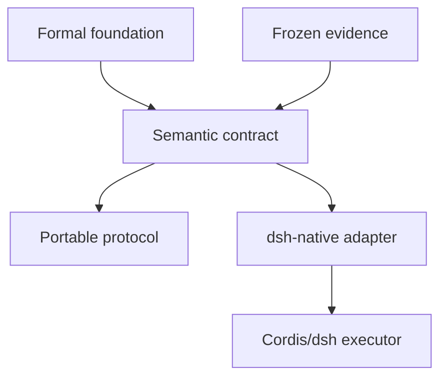
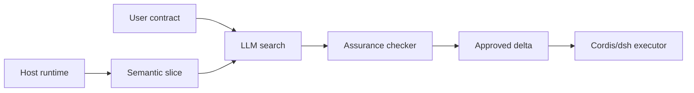

# Architecture

## Product layers

The semantic contract is the only normative product source. The formal layer explains its semantic basis. Frozen evidence supports the current product decisions. Portable and dsh-native surfaces project the same meanings for different environments.

## Runtime flow

Static semantics live in the Skill and contract. Dynamic software truth lives in Host state and read-only tools. Task intent stays in the user layer. Cordis/dsh executes lifecycle changes through its existing APIs.

## Layer A: formal foundation

The CTDD and Joint Canonicity texts define the fixed interpreter and the role of an extensional relational state. Project-specific facts enter (D); they do not generate a new Horn program. The formal texts are indexed under [`foundation/formal`](../foundation/formal/) and stay outside routine Agent context.

## Layer B: semantic contract

[`spec/semantic-contract.md`](../spec/semantic-contract.md) owns:

- stable identity and time;
- provenance and coverage;
- `KNOWN_VALUE`, `KNOWN_ABSENT`, and `UNKNOWN`;
- authority, assumptions, constraints, protected frame, and objectives;
- change regularization and semantic delta;
- obligation, assurance, and outcome vocabularies.

Design by Contract supplies responsibility discipline. Software Space supplies the semantic world on which that discipline is evaluated.

## Layer C: portable protocol

The Portable Skill is a specification and degraded implementation. When no native observer exists, an Agent builds a small issue-centered slice from available evidence. It keeps the same carriers and workflow without teaching the full theory or asking users to read CTR/Horn notation.

## Layer D: dsh-native reference implementation

The reference package is an independent, opt-in Host plugin. It registers two model-facing tools:

- `software_semantic_slice`: returns normalized identities, graph edges, lifecycle states, bindings, effect ownership, package/run state, coverage, and provenance. It does not return a root cause or repair.
- `software_semantic_assure`: checks selected typed obligations on an Agent proposal. It supplies no world facts.

The companion dsh Skill carries workflow discipline. The profile patch composes the package with the existing Cordis Host runner. No agent-loop changes or second plugin framework are required.

## Layer E: evidence

Frozen reports and raw artifacts live under [`research`](../research/). They explain why the interface exists, which effects replicated, which hypotheses remain open, and which instrumentation failures changed later protocols. They are not loaded into ordinary Agent sessions.

## Ownership boundaries

| Concern | Owner |
|---|---|
| Intent and authoritative requirements | User or upstream system |
| Observations within declared coverage | Harness and runtime adapter |
| Candidate search | LLM |
| Mechanical obligations | Checker and tests |
| Lifecycle execution | Cordis/dsh |
| Acceptance or contract revision | User or reviewer |
| Model continuity, compaction, and cache | Existing harness subsystems |

Software-state semantics and model continuity are orthogonal. The package implements the former and integrates with the latter only through dsh's normal model-visible logging path.

## Native and semantic interaction

| Native reconstruction | Interface-first semantic access |
|---|---|
| Agent visits multiple runtime domains and joins their state | Host joins covered domains once into a typed slice |
| Absence often depends on implicit API coverage | Coverage and absence status are explicit |
| Field names can obscure lifecycle meaning | Last-successful, next-target, and active-run are separate |
| Target and committed binding may be reconstructed late | Both appear as independent carriers |
| Native inspection remains available everywhere | Native escape is reserved for declared gaps |

## Extension rule

Add an adapter field only when a current consumer needs it. Document its coverage, authority, provenance, and relation to the core epistemic carrier. Do not add project-specific interpreter rules.
